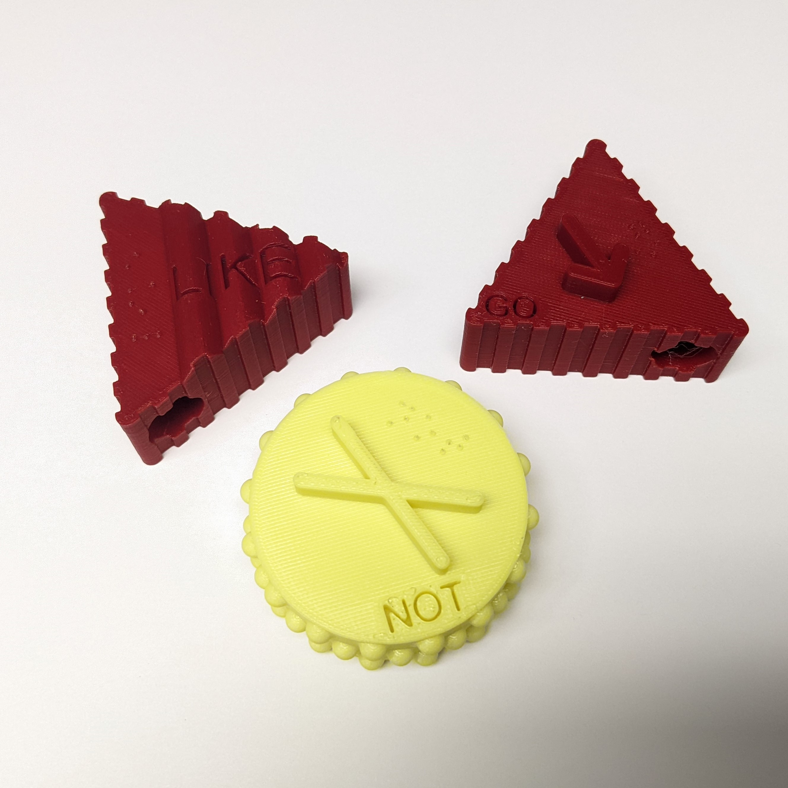

# Project Core 3D Symbols
The Project Core 3D symbols consists of a set of 3D printable three-dimensional (3D) symbols that represent 36 words in the Universal Core vocabulary. The word category is indicated with the shape, texture, and color of the base. The individual word is indicated with a unique raised element, the printed word, and the word in Braille. This repository contains a copy of Version 4, last updated January 2020. For instructions on how to introduce and use these symbols, refer to the original site: http://www.project-core.com/3d-symbols/   

| **Word Class** | **Shape** |              **Edge Texture**             | **Color** |
|:--------------:|:---------:|:-----------------------------------------:|:---------:|
|     adverb     |   circle  |     bumps (reverse golf ball dimples)     |   yellow  |
|    adjective   |   heart   |                   smooth                  |    blue   |
|     pronoun    |  hexagon  |                cross hatch                |   white   |
|   preposition  |   square  |             horizontal grooves            |   green   |
|      verb      |  triangle |       vertical ridges like a quarter      |    red    |
|      noun      | trapezoid |          horizontal wavy grooves          |   orange  |
|  interjection  |  pentagon | single string of bumps (string of pearls) |   black   |

## More info at
- [Project Core](http://www.project-core.com/)
- [Project Core 3D Symbols](http://www.project-core.com/3d-symbols)
- [Project Core 3D Symbol - Use Instructions](http://www.project-core.com/3d-symbols-use/)
- [Makers Making Change Project Page](https://makersmakingchange.com/project/project-core-3d-symbols/)
- [Makers Making Change Forum Thread](https://makersmakingchange.com/forum/topic/project-core-3d-symbols/)

## Getting Started

### 1. Determine which symbols are required
Refer to the usage guide and/or consult with the user to determine which of the symbols are required.

### 2. 3D Print the Symbols
All of the individual print files are in the [/Build_Files/3D_Print_Files](/Build_Files/3D_Print_Files/) folder.
Note that depending on the word class, there are 7 different intended colors of filament. The starter set (GO, LIKE, NOT) requires two filament colors: yellow and red. If printed in the intended colors, the full set of 36 requires 5 filament colors: yellow, blue, white, green, and red.

## Files
### Documentation
| Document             | Version | Link |
|----------------------|---------|------|
| Bill of Materials    | 1.0     | [Project-Core-3D-Symbols_Bill_of_Materials](/Documentation/Project-Core-3D-Symbols_BOM_V1.0.xlsx)     |
| Maker Checklist      | 1.0     | [Project-Core-3D-Symbols_Maker_Checklist](/Documentation/Project-Core-3D-Symbols_Maker_Checklist_V1.0.pdf)     |
| User Guide           | 09.25.17    | [Project-Core-3D-Symbols_Use](/Documentation/Project-Core-3D-Symbol_Use_09.25.17)    |
| Changelog            | 1.0     | [Project-Core-3D-Symbols_Changelog](/Documentation/Project-Core-3D-Symbols_Changelog_V1.0.pdf)     |

### Design Files
Unfortunately, the original design files are not available for this project.

### Build Files
 - [3D Print Files](/Build_Files/3D_Print_Files)

 Note: The original filenames have been changed to the following format: WORD_COLOR_VERSION.stl. This should make it easier to print the symbols in the intended color if so desired.

## Attribution
The 3D Universal Core Vocabulary Symbols were designed by [The Center for Literacy and Disability Studies](http://www.project-core.com/3d-symbols/).

The Bill of Materials and the 3D Printing Guide were created by Neil Squire / Makers Making Change. 

## License

The 3D Universal Core Vocabulary Symbols by [The Center for Literacy and Disability Studies](https://www.project-core.com/3d-symbols/) are licensed under a [Creative Commons Attribution 4.0 International License](https://creativecommons.org/licenses/by/4.0/).

----

## About Us

Makers Making Change is an initiative of [Neil Squire](https://www.neilsquire.ca/), a Canadian non-profit that helps people with disabilities.

We are committed to creating a network of volunteer makers who support people with disabilities in their communities through 3D printing assistive devices. Check out our library of free, open-source assistive technologies with parts and build instructions.

 - [www.MakersMakingChange.com](https://www.makersmakingchange.com/)
 - [GitHub](https://github.com/makersmakingchange)
 - [Thingiverse](https://www.thingiverse.com/makersmakingchange/about)
 - Twitter: [@makermakechange](https://twitter.com/makermakechange)
 - Instagram: [@makersmakingchange](https://www.instagram.com/makersmakingchange)

## Contact Us

For technical questions, to get involved, or share your experience we encourage you to visit the [MMC Forum](https://makersmakingchange.com/forum), or contact info@makersmakingchange.com
